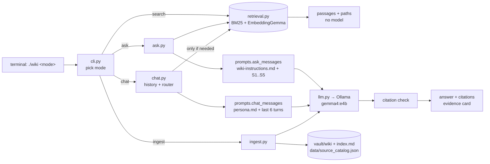
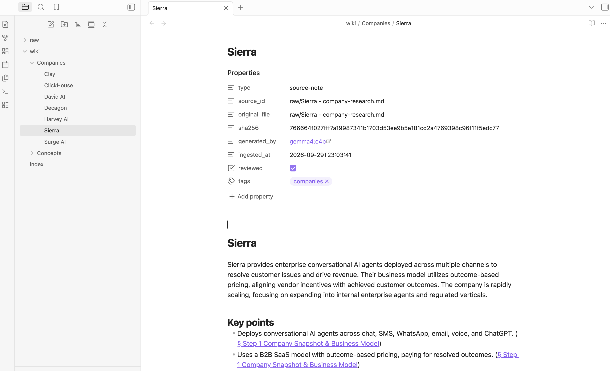
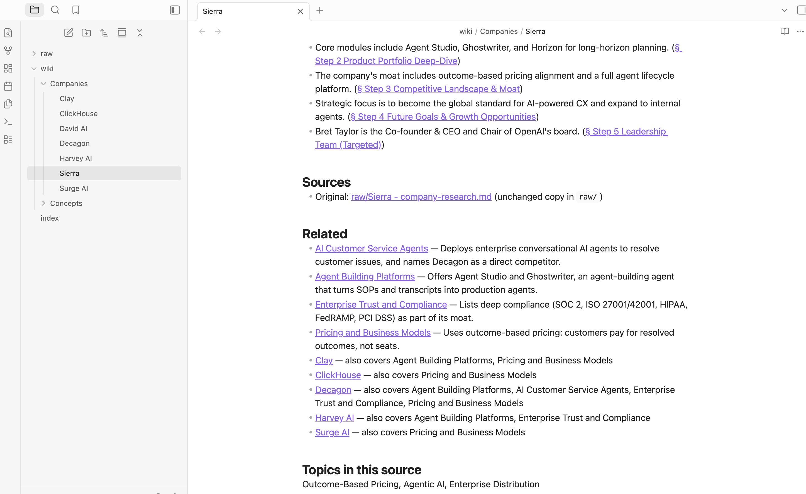
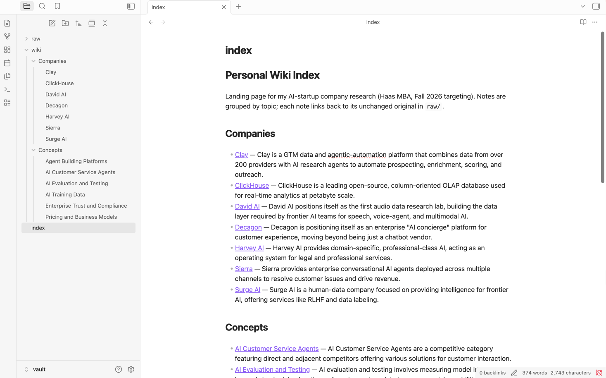
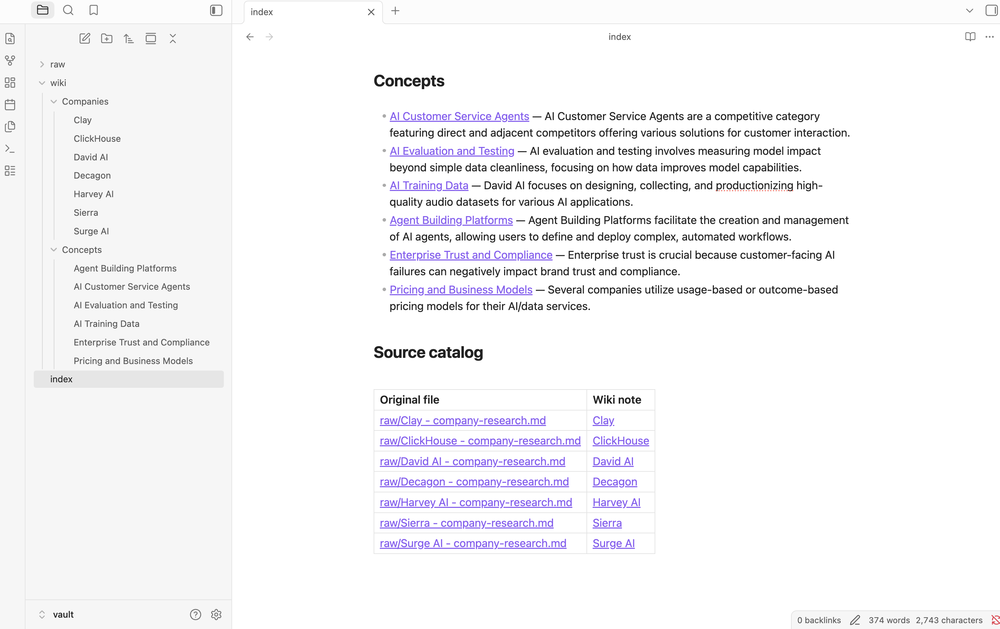
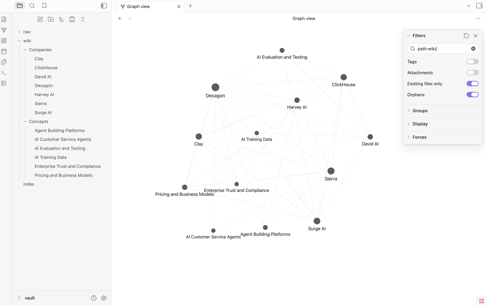
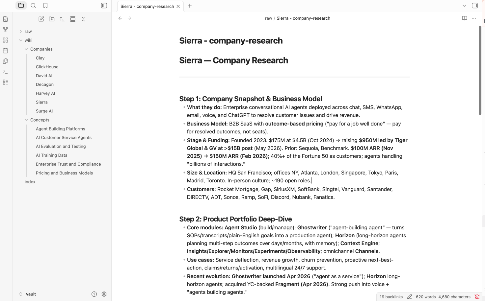

# Personal Wiki CLI — Local Gemma + RAG

A command-line personal wiki over my AI-startup company research (Haas MBA, Fall 2026). My own harness turns
unchanged research notes into a linked Obsidian wiki with **local Gemma 4 E4B**, and exposes three distinct modes:
**chat** (personal assistant), **ask** (grounded, cited answers), and **search** (original passages, no model).
Everything runs offline on a MacBook Air M4.

**Result:** in the official offline run, all four ask-mode tests passed: three grounded, cited answers and one
insufficient-evidence refusal. All chat and search mode checks passed, with two documented caveats. Assessment of every test: **[`evals/RESULTS.md`](evals/RESULTS.md)**.

| Quick links | |
|---|---|
| CLI + harness code | [`wikicli/`](wikicli/) · launcher [`wiki`](wiki) · offline tests with a fake model [`tests/`](tests/test_harness.py) |
| Instructions sent to the model | [`instructions/`](instructions/): [research rules](instructions/wiki-instructions.md), [persona](instructions/persona.md), [ingest rules](instructions/ingest-instructions.md) |
| Obsidian vault | [`vault/`](vault/) · landing page [`vault/index.md`](vault/index.md) · source catalog [`data/source_catalog.json`](data/source_catalog.json) |
| Test set (written before testing) | [`evals/questions.md`](evals/questions.md) |
| **Results + assessments** | [`evals/RESULTS.md`](evals/RESULTS.md) |
| Ask-mode evidence cards (offline) | [Test 1](evidence/ask/20260930-160154-offline-test1.md) · [Test 2](evidence/ask/20260930-160201-offline-test2.md) · [Test 3](evidence/ask/20260930-160209-offline-test3.md) · [Test 4 (unsupported)](evidence/ask/20260930-160215-offline-test4-unsupported.md) |
| Chat / search mode checks (offline) | [chat capabilities](evidence/mode_checks/20260930-160253-offline-chat-capabilities.md) · [chat follow-up](evidence/mode_checks/20260930-160403-offline-chat-followup.md) · [chat claim ≠ evidence](evidence/ask/20260930-160405-offline-chat-claim-not-evidence.md) · [search](evidence/search/20260930-160146-search.md) · [errors with model stopped](evidence/offline/no-model-checks.log) |
| Offline demonstration | [terminal log](evidence/offline/offline-run-20260930-160030.log) · [screen recording (4 min)](evidence/offline/offline-demo.mp4) |
| Obsidian screenshots | [`evidence/screenshots/`](evidence/screenshots/) (see §5) |
| Wiki review + re-ingestion | [review log](evidence/wiki-review/REVIEW.md) · [duplicate check](evidence/measurements/reingest-check.log) |
| Retrieval evaluations (v1 → v2d) | [`evidence/search/`](evidence/search/) (see §5) |

---

## 1. Purpose and sources

**What the wiki is for:** quick, verifiable recall of facts about seven AI startups I researched (business model,
funding, products, competitors, leadership, hiring) — e.g. "how does Sierra price?" or "who competes with Scale AI?"

| Original (unchanged, in `vault/raw/`) | Words | Wiki note | Shared themes (concept notes) |
|---|---|---|---|
| [Clay - company-research.md](vault/raw/Clay%20-%20company-research.md) | 697 | [Clay](vault/wiki/Companies/Clay.md) | Agent Building Platforms · Pricing and Business Models |
| [ClickHouse - company-research.md](vault/raw/ClickHouse%20-%20company-research.md) | 621 | [ClickHouse](vault/wiki/Companies/ClickHouse.md) | Pricing and Business Models · AI Evaluation and Testing |
| [David AI - company-research.md](vault/raw/David%20AI%20-%20company-research.md) | 2,898 | [David AI](vault/wiki/Companies/David%20AI.md) | AI Training Data · AI Evaluation and Testing |
| [Decagon - company-research.md](vault/raw/Decagon%20-%20company-research.md) | 3,421 | [Decagon](vault/wiki/Companies/Decagon.md) | AI Customer Service Agents · Agent Building Platforms · Pricing and Business Models · Enterprise Trust and Compliance · AI Evaluation and Testing |
| [Harvey AI - company-research.md](vault/raw/Harvey%20AI%20-%20company-research.md) | 686 | [Harvey AI](vault/wiki/Companies/Harvey%20AI.md) | Agent Building Platforms · Enterprise Trust and Compliance |
| [Sierra - company-research.md](vault/raw/Sierra%20-%20company-research.md) | 637 | [Sierra](vault/wiki/Companies/Sierra.md) | AI Customer Service Agents · Agent Building Platforms · Pricing and Business Models · Enterprise Trust and Compliance |
| [Surge AI - company-research.md](vault/raw/Surge%20AI%20-%20company-research.md) | 560 | [Surge AI](vault/wiki/Companies/Surge%20AI.md) | AI Training Data · Pricing and Business Models · AI Evaluation and Testing |

The six concept notes live in [`vault/wiki/Concepts/`](vault/wiki/Concepts/). Each links to at least two companies
and says why each one belongs.

**Privacy / redaction.** The originals were private job-search research files. Before they entered this repo,
[`scripts/redact_sources.py`](scripts/redact_sources.py) removed personal content only (my name, resume metrics, fit
assessments, cold-pitch drafts, outreach contacts, a local file path). Company facts were not edited. The redacted
copies in `vault/raw/` are the "originals" for this project and are never modified by the harness; private files stay
outside the repository.

**How originals connect to generated pages.** Each raw file has a stable `source_id` (its path under `raw/`).
`data/source_catalog.json` maps `source_id → sha256, note title, folder`. Every wiki note carries `source_id`,
`original_file` and `sha256` in its frontmatter, links to `[[raw/<file>]]`, and each key point links to the exact heading
in the original (`[[raw/Sierra - company-research.md#Step 1 Company Snapshot & Business Model|§ Step 1 …]]`).

## 2. Setup and device

### Device
| | |
|---|---|
| Machine | MacBook Air (Mac16,12), macOS 15.3 |
| CPU / GPU | Apple M4 — 10-core CPU (4P + 6E), 8-core GPU |
| Memory | 16 GB unified memory (≈61% free before loading the model) |
| Free disk | ≈28 GB |

### Model and runtime
| | |
|---|---|
| Generation model | **Gemma 4 E4B instruction-tuned**, Ollama tag `gemma4:e4b` (= `gemma4:e4b-it-q4_K_M`) |
| Quantization | **Q4_K_M** (4-bit), model file 5.49 GB + 0.99 GB vision/audio projector (unused for text) |
| Embedding model | **EmbeddingGemma** (`embeddinggemma`, 0.62 GB) for hybrid retrieval |
| Runtime | Ollama 0.34.4 (Homebrew), Metal GPU offload |
| Python | 3.13.15 · `ollama` 0.6.3 · `rank-bm25` 0.2.2 · `numpy` 2.5.3 · `rich` 15.0.0 · `pypdf` 6.19.0 |
| Official source | https://ollama.com/library/gemma4 · Gemma docs https://ai.google.dev/gemma/docs/core |

### Measured on this machine
| Measurement | Value | How measured |
|---|---|---|
| Ollama memory while Gemma is loaded | **4.6 GB peak** during full ingest; 4.5 GB with Gemma + EmbeddingGemma loaded after the offline run | summed RSS of the Ollama processes, sampled every 2 s ([ingest log](evidence/measurements/ingest-run2.log), [offline log](evidence/offline/offline-run-20260930-160030.log) step 9). `ollama ps` reports only 279 MB because the weights are memory-mapped, so it understates the footprint |
| Harness (Python CLI) memory | 60–75 MB peak | `/usr/bin/time -l` max RSS |
| Cold model load | 34.6 s (first answer 37.4 s) | Ollama `load_duration` |
| **Ask answer latency (warm, offline)** | **5.6–8.0 s** for ≈1,000–1,230 prompt tokens and 28–71 output tokens | [offline evidence cards](evals/RESULTS.md) |
| Generation speed | ≈16.6 tokens/s (100% GPU) | Ollama `eval_count / eval_duration` |
| Thinking mode on vs off | 15.5 s vs 2.4 s for the same one-sentence answer | test call, same prompt |
| **Full ingestion, 7 sources** | **565 s (9.4 min)**: 7 summaries + theme consolidation + 5 concept notes + embeddings | `/usr/bin/time` ([log](evidence/measurements/ingest-run2.log)) |
| Ingest one source offline (`--force`, includes cold load) | 74.5 s | offline log, step 3 |
| Re-ingest with nothing changed | 9 s, no Gemma calls | [duplicate check](evidence/measurements/reingest-check.log) |
| Chat turn | 11–35 s (replies are long) | offline chat transcripts |

**Why E4B on this machine.**
- **Memory:** 16 GB of unified memory with ≈9.8 GB free before loading. E4B's measured 4.6 GB leaves ≈5 GB of headroom for the OS, Obsidian, and the browser, with no swapping during the runs.
- **Too big:** the 26B A4B MoE (≈14.4 GB at Q4_0) would not fit next to the OS, because it must load all 26B weights.
- **Not tested:** I did not run E2B. I chose E4B over E2B because ingestion depends on following a JSON schema and summarizing multi-page, table-heavy documents.
- **Result:** E4B proved sufficient, with 4/4 ask tests passing. An answer latency of 5–8 s is acceptable for a personal wiki. If latency or memory became a problem, E2B would be the next step down.
- **Quantization:** Q4_K_M is Ollama's default 4-bit build of E4B. The file is 5.49 GB, larger than the official 4.5 GB Q4_0 estimate because of E4B's embedding tables.

### Install (online, once)
```bash
brew install ollama
brew services start ollama
ollama pull gemma4:e4b
ollama pull embeddinggemma
uv venv --python 3.13 .venv && uv pip install --python .venv/bin/python -r requirements.txt
```

### Commands
```bash
./wiki --help                       # commands, configuration, examples
./wiki ingest vault/raw             # raw → Gemma → wiki notes, index.md, retrieval index
./wiki search "outcome-based pricing"   # original passages only, no model (works with Ollama stopped)
./wiki ask "What is Sierra's pricing model?"   # standalone, cited answer (local by default)
./wiki chat                         # personal assistant "Sage"; /save /sources /clear /exit
./wiki check                        # every [[link]] resolves, names/headings are readable
./wiki search "pricing" --include-wiki --save   # also search generated summaries; save an evidence card
./wiki ingest "vault/raw/Sierra - company-research.md" --force   # regenerate one source's note
evals/run_offline.sh                # the full offline demonstration (help, ingest, search, 4 asks, chat checks)
.venv/bin/python evals/retrieval_check.py mylabel     # retrieval-only evaluation of the 4 test questions
.venv/bin/python -m unittest tests.test_harness       # harness tests with a fake model (no Ollama needed)
```
Errors are explicit: Ollama not running → exit 3 with `brew services start ollama`; model missing →
`ollama pull gemma4:e4b`; no index → `./wiki ingest vault/raw`; empty `raw/` → "Add files to vault/raw/ first".
`--mode online` is not configured and says so (local is the only and default mode).

## 3. Architecture

Five separate pieces, which the code keeps separate as well:

| Piece | What it is here | Code |
|---|---|---|
| **Model** | Gemma 4 E4B served by Ollama. It only sees the `messages` the harness sends. It does not read files, remember sessions, or call tools. | [`wikicli/llm.py`](wikicli/llm.py) |
| **Retrieval tool** | Local hybrid search that returns original passages with path + section. It never generates text. | [`wikicli/retrieval.py`](wikicli/retrieval.py), [`wikicli/chunker.py`](wikicli/chunker.py) |
| **RAG workflow** | retrieve → put numbered passages in the prompt → Gemma answers only from them → check citations | [`wikicli/modes/ask.py`](wikicli/modes/ask.py) |
| **Harness** | Everything around the model: mode selection, instructions, chat memory, the decision to retrieve, prompt assembly, model calls, citation checks, errors, evidence logging, ingestion | [`wikicli/`](wikicli/) |
| **CLI** | The terminal interface to the harness (`argparse`) | [`wikicli/cli.py`](wikicli/cli.py), [`wiki`](wiki) |



### One question traced end to end (`./wiki ask "What is Sierra's pricing model?"`)
1. [`wiki`](wiki) runs `.venv/bin/python -m wikicli.cli ask "…"`.
2. `cli.main()` parses argv. The `ask` subcommand defaults to `--mode local` (online exits with a clear message), and the harness dispatches to `modes.ask.run()`.
3. `ask.answer()` calls **`retrieval.search(question, k=5)`**:
   - It loads `data/chunks.jsonl` (passages outside the vault) and keeps only **originals** from `raw/` (`config.EVIDENCE_KINDS`); generated wiki summaries are never cited as evidence.
   - It scores them with BM25.
   - It embeds the query with EmbeddingGemma through the local Ollama and takes the cosine similarity against `data/embeddings.npy`.
   - It fuses the two rankings with weighted Reciprocal Rank Fusion (embedding vote × 2.0).
   - It drops passages that clear neither the BM25 nor the cosine floor, keeps at most 3 passages per source file, and returns the top 5 with `path`, `section`, and scores.
4. `prompts.ask_messages()` builds a two-message prompt: system = [`instructions/wiki-instructions.md`](instructions/wiki-instructions.md) (neutral, cite `[S#]`, exact `INSUFFICIENT EVIDENCE` phrase); user = the numbered passages `[S1] (raw/Sierra… > Step 1…)` plus the question. **No chat history and no persona.**
5. `llm.chat()` checks that Ollama is up and the model is pulled (otherwise it raises `ModelUnavailable` → exit 3 with a fix). It then calls `ollama.chat(model="gemma4:e4b", options={temperature: 0.1, num_ctx: 8192})` and times the call.
6. `ask.check_citations()` parses the `[S#]` references and flags three things: any number that wasn't provided, an answer with no citations, and the insufficient-evidence phrase. It maps each valid `S#` back to `path › section`.
7. The CLI prints the answer, the resolved citations, any warnings, and the latency. `evidence.save("ask", …)` writes a JSON record and a Markdown card to `evidence/ask/` (question, passages, answer, citation check, model, `execution: local`).

### How each mode is enforced
| | chat | ask | search |
|---|---|---|---|
| Instructions | [`persona.md`](instructions/persona.md) (voice + real capabilities + commands) | [`wiki-instructions.md`](instructions/wiki-instructions.md) (research rules) | none |
| Conversation context | last 6 user/assistant turns | **none**; every question is standalone | none |
| Retrieval | only when the router says so (see §4) | always, top 5 | always; this *is* the output |
| Model call | yes (temperature 0.7) | yes (temperature 0.1) | **no** |
| Output | reply + "retrieval: yes/no (reason)" | answer + checked citations, or `INSUFFICIENT EVIDENCE` | passages, paths, scores |
| Saved | transcript → `evidence/mode_checks/`; `/save` drafts → `data/chat_saves/` (never indexed) | card → `evidence/ask/` | `--save` → `evidence/search/` |

Chat history is kept only in memory for that session, and chat drafts are saved outside the vault. So nothing said in
chat can become evidence for `ask`.

## 4. Design choices

**Folders and naming.** `vault/` is the only folder opened in Obsidian: `raw/` holds the unchanged originals, `wiki/Companies/`
has one note per company, `wiki/Concepts/` has ideas shared by two or more companies, and `index.md` is the grouped
landing page. Code, chunks, embeddings, the catalog, evals and evidence all live outside the vault. Gemma proposes a
title, and the harness cleans it into a short Title Case filename (at most 6 words, no hashes/dates/underscores). The
first heading always equals the filename, and `./wiki check` enforces both rules.

**Re-ingestion without duplicates.** The catalog keys each note by `source_id`. On re-ingest, an unchanged file (same
sha256) is not re-summarized; only its links are re-rendered. A changed file regenerates the **same** note path, because
the established title and folder are reused and never re-proposed. Notes a human marked `reviewed: true` are never
overwritten without `--force`. Concept notes are keyed by a normalized concept name, and they are removed if they stop
being shared by at least two sources.

**Links that mean something.** Company notes link to a concept note only when Gemma listed that concept for the company,
and they carry Gemma's one-line "why". Two companies link to each other only when they share a concept ("also covers
Outcome-Based Pricing"). Concepts that appear in a single source are listed as plain text, not as links, so no link
ever points to an empty note.

**Passage size and context budget.** Passages are about 800 characters (150-character overlap), split at headings, then at
paragraphs, then at table rows (added after tables were being cut mid-row). Ask sends 5 passages (≈1k tokens) plus
rules, well inside `num_ctx 8192`. For ingestion Gemma sees up to 16,000 characters (≈4k tokens) of a source per call.
The two longest files (David AI, Decagon) are split into two calls whose outputs are merged.

**Retrieval.** v1 was BM25 only, so search works with no model. Retrieval-only evaluation drove each later change
(before/after table in §5):
- **Paraphrases:** BM25 failed on reworded questions, so I added local EmbeddingGemma vectors with weighted RRF. The embedding vote counts twice, because it ranked the paraphrased passage #1 while BM25 ranked it #13.
- **One file filling every slot:** I added a per-source cap of 3 (a cap of 2 pushed out Sierra's key passage).
- **Summaries crowding out originals:** after ingestion the generated wiki summaries outranked the originals, so ask and search now cite `raw/` only. Chat may also use the summaries, labeled "wiki summary".
- **Fallback:** BM25 alone is used if Ollama is down.

**When chat retrieves.** A rule-based router in [`chat.py`](wikicli/modes/chat.py) decides per turn:
1. **Search** when the message mentions "my notes", the wiki, a class, or one of the 7 companies. This rule is checked first.
2. **Reuse the previous turn's passages** for edits of the last reply ("make that shorter", "rewrite", "bullet"), so `[S#]` labels stay valid.
3. **No search** for greetings and capability questions ("what can you help me with?").
4. **Otherwise**, search only for a question with a strong keyword match (BM25 ≥ 6) in `raw/`.

Every turn prints the decision and its reason. A **harness-level citation guard** flags any reply that writes `[S#]`
without passages, or cites a passage that was not given. The rule order and the guard came from a failure in a
hand-typed test (§6).

**Personality vs. research rules.** "Sage" (warm, concise study buddy) exists only in `persona.md`. That file also lists
exactly what the assistant can and cannot do, so capability answers are accurate. Ask mode never loads it.

**Model settings that matter.**
- **Thinking off** (`think=False`): Gemma 4 thinks by default, which took 15.5 s vs 2.4 s for the same answer. RAG
  supplies the facts, so hidden reasoning added latency without improving grounded answers.
- temperature 0.1 for ask, 0.7 for chat, 0.2 for ingest.
- Research rule added after a test failure: report numbers as written, never name the metric unless the passage does.
- `format: json` for ingestion so the output can be parsed; a malformed JSON response gets one retry.
- `num_ctx 8192`.
- `keep_alive 10m`, so the first call pays the model-load time and later calls don't.

## 5. Evidence

### Retrieval evaluated before the model (`evals/retrieval_check.py`, no Gemma involved)
The question set was written first ([`evals/questions.md`](evals/questions.md)). Retrieval was evaluated on its own,
and every configuration change was rerun and kept:

| Version (evidence file) | Change | Q1 Sierra pricing | Q2 Surge funding (paraphrase) | Q3 Scale AI rivals (2 sources) |
|---|---|---|---|---|
| [v1](evidence/search/retrieval-v1-bm25-baseline.md) | BM25 only | ✅ | ❌ wording mismatch | ❌ David AI filled all 5 slots |
| [v2a](evidence/search/retrieval-v2a-bm25-diversity.md) | + max 2 passages per source, drop `---` passages | ❌ Step 1 pushed out | ✅* | ✅ |
| [v2b](evidence/search/retrieval-v2b-hybrid-with-wiki-summaries.md) | + EmbeddingGemma, index now includes generated wiki notes | ❌ | ❌ | ❌ summaries outranked originals |
| [v2](evidence/search/retrieval-v2-hybrid-embeddinggemma.md) | ask/search cite **originals only** | ❌ cap still too strict | ✅* | ✅ |
| [v2c](evidence/search/retrieval-v2c-hybrid-cap3.md) | per-source cap 2 → 3 | ✅ | ✅* | ✅ |
| [sweep](evidence/search/) `retrieval-sweep-w*.md` | stricter check (expected **wording**); embedding weight 1.0 / 1.5 / 2.0 / 3.0 | ✅ all | ❌ ❌ ✅ ✅ | ✅ all |
| **[v2d](evidence/search/retrieval-v2d-hybrid-weighted.md) (final)** | weighted fusion, embedding weight 2.0 (the smallest weight that passed) | ✅ | ✅ | ✅ |

\* The early checks passed Q2 whenever *any* passage from Surge's "Step 1" section was retrieved. The first ask-mode dry run
showed that was too lenient: the section is split into two passages, and only the headcount/customers half came back.
Gemma answered "insufficient evidence", which was **correct for the evidence it was given**. The check now requires
the expected wording in a retrieved passage.

### Four ask-mode tests: official offline run (model `gemma4:e4b`, local, 7 redacted sources)
Full passages, answers, citation checks, and assessments: **[`evals/RESULTS.md`](evals/RESULTS.md)**.

| # | Question | Retrieved expected passage | Actual Gemma answer (abridged) | Citations | Verdict |
|---|---|---|---|---|---|
| 1 | What is Sierra's pricing model? | S2 = Sierra › Step 1 | "…outcome-based pricing, which means customers pay for resolved outcomes rather than for seats [S2]… 'pay for a job well done' [S2]" | S2 ✔ verbatim in source | **Pass** |
| 2 | Where does Surge AI get its operating capital? | S3 = Surge › Step 1 | "Surge AI is entirely bootstrapped and has received zero external funding [S3]. The company is profitable from day one [S3]." | S3 ✔ | **Pass** |
| 3 | Which AI data companies list Scale AI as a competitor? | S1 = David AI › §3, S2 = Surge › Step 3 | "…listed as a competitor by David AI and Surge AI [S1][S2]…" plus each company's details | S1 ✔ S2 ✔ | **Pass** |
| 4 | What was Decagon's ARR in 2025? *(unsupported)* | Decagon funding/valuation only; no ARR anywhere | "INSUFFICIENT EVIDENCE: the wiki does not contain information about Decagon's annual recurring revenue in 2025." | none | **Pass** |

Failures along the way were kept, not replaced:
- [Test 2 dry run](evidence/ask/20260929-230618-dryrun-test2.md): wrong passage retrieved, so the model correctly refused.
- [Test 3 dry run](evidence/ask/20260929-231249-dryrun2-test3.md): "~$29B" was called "revenue", a claim the source doesn't support.

Both were fixed, and all four tests were rerun.

### Chat / search mode checks (same offline run)
| Check | Result |
|---|---|
| `wiki search "outcome-based pricing"` | original passages with paths and scores, **no generated answer** ([card](evidence/search/20260930-160146-search.md)); also works with Ollama stopped (BM25 fallback, [log](evidence/offline/no-model-checks.log)) |
| chat: "what can we do?", "what can you help me with?" | `retrieval: no`; accurate capabilities and commands; no refusal ([transcript](evidence/mode_checks/20260930-160253-offline-chat-capabilities.md)) |
| chat: draft a 5-step plan "based on my notes" → "make that shorter" | first turn `retrieval: yes` with citations; follow-up `retrieval: no`, shortened from the conversation ([transcript](evidence/mode_checks/20260930-160403-offline-chat-followup.md)) |
| chat claim "Decagon's ARR was $300M" → standalone `ask` | chat labeled it as user-provided and not in the wiki; ask still answered **INSUFFICIENT EVIDENCE** ([card](evidence/ask/20260930-160405-offline-chat-claim-not-evidence.md)) |
| **hand-typed chat** (after the offline run) | ❌ first attempt: "Give me a 3-bullet summary of Sierra from my notes" skipped retrieval ("bullet" matched the edit rule), and Gemma **fabricated `[S1]`–`[S3]` citations** ([screenshot](evidence/screenshots/07-chat-interactive-BUG-fabricated-citations.png), [transcript](evidence/mode_checks/20260930-163956-chat.md)). ✅ after the fix: `retrieval: yes`, real passages, valid labels, and the follow-up reuses them ([re-test](evidence/mode_checks/20260930-164202-fix-check-chat-bullet.md)). Details in [RESULTS](evals/RESULTS.md#hand-typed-chat-test-after-the-offline-run-a-failure-found-and-fixed) |
| error handling | model stopped → `ask`/`chat` exit 3 with the fix; missing file → exit 4; `--mode online` → "not configured" ([log](evidence/offline/no-model-checks.log)) |

### Offline demonstration
The [terminal log](evidence/offline/offline-run-20260930-160030.log) and [screen recording](evidence/offline/offline-demo.mp4)
(4 min, Wi‑Fi and hotspot off) show the whole sequence. The script is [`evals/run_offline.sh`](evals/run_offline.sh).
1. `INTERNET: UNREACHABLE (offline confirmed)`, device and model identity, model unloaded.
2. `./wiki --help`.
3. **Offline ingestion** of `raw/Clay…` (Gemma rewrote the note, 74.5 s), then `./wiki check` (0 problems).
4. Search, the four ask tests, both chat checks, and the chat-claim check.
5. Memory.

### Obsidian: the vault as a human sees it
Vault opened at `vault/`. Graph filter: `path:wiki/`, Attachments **off**, Tags off.

| | |
|---|---|
| **Open note with source references**: `Sierra.md`, heading = filename, frontmatter keeps `source_id`/`sha256`, each key point links to the exact section of the original<br> | **Sources and meaningful related links**: each concept link says *why*, and company links say which themes they share<br> |
| **Topic-organized index and page list**: Companies / Concepts folders<br> | **Concepts and the source catalog** (original file → wiki note)<br> |
| **Graph view**, readable labels: companies connect only through shared themes<br> | **Traced back to evidence**: clicking `§ Step 1…` in the Sierra note opens the unchanged original (19 backlinks)<br> |

Trace example: [index](vault/index.md) → [Sierra](vault/wiki/Companies/Sierra.md) → related note
[AI Customer Service Agents](vault/wiki/Concepts/AI%20Customer%20Service%20Agents.md) → its member
[Decagon](vault/wiki/Companies/Decagon.md) → `§ 3. Competitive Landscape & Moat` in
[raw/Decagon…](vault/raw/Decagon%20-%20company-research.md), where the original lists Sierra as a direct competitor.

`./wiki check` verifies that every `[[link]]` and `#heading` anchor resolves (0 problems across 14 notes). Re-ingesting
all sources, then force-re-ingesting Sierra, left the note list byte-for-byte identical
([duplicate check](evidence/measurements/reingest-check.log)). The raw files' sha256 still match the catalog.

### Wiki review: generated text corrected against the originals
Full log: [`evidence/wiki-review/REVIEW.md`](evidence/wiki-review/REVIEW.md).

**Ingest run 1 was rejected:**
- Titles were padded, e.g. "Harvey AI Company Research".
- It produced 0 concept notes, because every source named the same idea differently.

Both were fixed in the harness. Gemma's first theme set was then reviewed: vague and overlapping themes were merged and
renamed, and missing Sierra↔Decagon and David AI↔Surge AI relations were added.

**Five statements were corrected**, including a cross-passage error that attributed Sierra's HIPAA certification to Harvey AI.

## 6. Reflection

**Real failure: a confident, cited, wrong fact.** When Sierra was re-ingested, Gemma regenerated the concept note
*Enterprise Trust and Compliance* with this line:

> "certifications like SOC2 II, ISO 27001/27701/42001, GDPR, and HIPAA"

It cited the Harvey AI file. Harvey's original never mentions HIPAA; Sierra's does. Both passages sat side by side in
the prompt, and the model merged them into one sentence under one citation. The previous version of the same note was
correct, so regeneration introduced the error even though the source hadn't changed.

The same pattern showed up in ask mode, where "~$29B" became "revenue of ~$29B". The citation pointed at the right
passage, but the claim went beyond it. **A citation shows where the model looked, not that the claim is true.**
- **Cause (likely):** a 4B-effective model at temperature 0.2 compressing several short, fact-dense passages that share
  vocabulary (compliance lists, dollar figures). The citation check only verifies that `[S#]` exists, not that the
  sentence is entailed by it.
- **What I did:**
  - Corrected the note and marked reviewed notes so regeneration can't overwrite them.
  - Scoped `--force` to named files.
  - Added a numeric-claim rule to the research instructions, then reran all tests.
- **Improvement I would try next:** a claim-level verification pass in the harness. After an answer or a concept note is
  generated, split it into sentences and, for each sentence, ask Gemma (or check with keyword overlap for entities and
  numbers) whether the cited passage *alone* supports it. Unsupported sentences get flagged or dropped. In this corpus
  a cheap first version would already catch both errors: every number and proper noun in a sentence must appear in the
  text of the passage it cites. "HIPAA" is not in the Harvey passage, and "revenue" is not attached to "~$29B".

**Second real failure: fabricated citations in chat, found by typing by hand.** All scripted checks passed, but the
first hand-typed request, "Give me a 3-bullet summary of Sierra from my notes", went wrong in two steps:
- **Harness bug:** the router checked its "edit the previous reply" rule (which matched "bullet") before its "my notes" rule, so no passages were retrieved.
- **Model behavior:** with no evidence and a persona that talks about citing notes, Gemma wrote `[S1]`–`[S3]` anyway and summarized Sierra as an agent that "reasons about the environment". None of that is in the notes.

Fixes:
- Rule order: notes and company cues win.
- Follow-ups reuse the previous passages.
- The harness now flags `[S#]` markers that have no matching passages, instead of trusting the model.
- A "never cite without passages" persona rule.
- A regression test for this exact message.

Lesson: scripted tests share the author's phrasing. One real user message exercised a path none of them did.

**Other observed limitations:**
- Chat follows the "flag unverified user claims" rule inconsistently. The ask/chat boundary is enforced by the harness,
  not the prompt.
- The chat retrieval router is still rule-based, so an unusual phrasing about the notes may skip retrieval. The citation
  guard now makes this visible instead of silent. A small classifier call, or always retrieving and letting the model
  ignore irrelevant passages, would be the next step.
- Chat turns take 11–35 s on this laptop.
