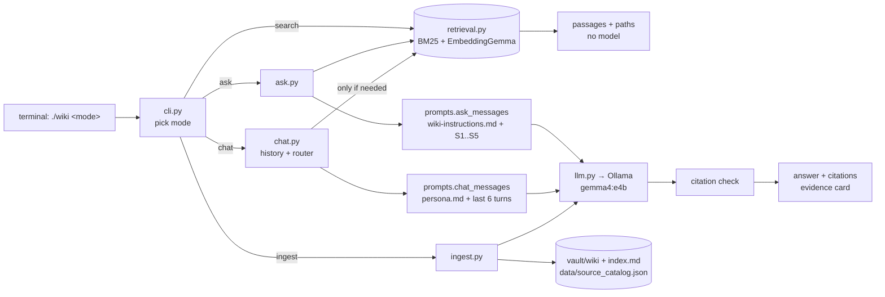

# Personal Wiki CLI — Local Gemma + RAG

A command-line personal wiki over my AI-startup company research (Haas MBA, Fall 2026). My own harness turns
unchanged research notes into a linked Obsidian wiki with **local Gemma 4 E4B**, and exposes three distinct modes:
**chat** (personal assistant), **ask** (grounded, cited answers), and **search** (original passages, no model).
Everything runs offline on a MacBook Air M4.

| Quick links | |
|---|---|
| CLI + harness code | [`wikicli/`](wikicli/) · launcher [`wiki`](wiki) |
| Instructions sent to the model | [`instructions/`](instructions/) (research rules, persona, ingest rules) |
| Obsidian vault | [`vault/`](vault/) · landing page [`vault/index.md`](vault/index.md) |
| Test set (written before testing) | [`evals/questions.md`](evals/questions.md) |
| Ask-mode evidence cards | _TODO_ |
| Chat / search mode checks | _TODO_ |
| Retrieval evaluations (v1 → v2) | [`evidence/search/`](evidence/search/) |
| Offline demonstration | _TODO_ |
| Obsidian screenshots | _TODO_ |

---

## 1. Purpose and sources

**What the wiki is for:** quick, verifiable recall of facts about seven AI startups I researched (business model,
funding, products, competitors, leadership, hiring) — e.g. "how does Sierra price?" or "who competes with Scale AI?"

| Original (unchanged, in `vault/raw/`) | Wiki note | Topic |
|---|---|---|
| _TODO: filled from `data/source_catalog.json` after ingestion_ | | |

**Privacy / redaction.** The originals were private job-search research files. Before they entered this repo,
[`scripts/redact_sources.py`](scripts/redact_sources.py) removed personal content only (my name, resume metrics, fit
assessments, cold-pitch drafts, outreach contacts, a local file path). Company facts were not edited. The redacted
copies in `vault/raw/` are the "originals" for this project and are never modified by the harness; private files stay
outside the repository.

**How originals connect to generated pages.** Each raw file has a stable `source_id` (its path under `raw/`).
`data/source_catalog.json` maps `source_id → sha256, note title, folder`. Every wiki note carries `source_id`,
`original_file` and `sha256` in its frontmatter, links to `[[raw/<file>]]`, and each key point links to the exact heading
in the original (`[[raw/Sierra - company-research.md#Step 1: ...|§ Step 1 ...]]`).

## 2. Setup and device

### Device
| | |
|---|---|
| Machine | MacBook Air (Mac16,12), macOS 15.3 |
| CPU / GPU | Apple M4 — 10-core CPU (4P + 6E), 8-core GPU |
| Memory | 16 GB unified memory (≈61% free before loading the model) |
| Free disk | ≈28 GB |

### Model and runtime
| | |
|---|---|
| Generation model | **Gemma 4 E4B instruction-tuned**, Ollama tag `gemma4:e4b` (= `gemma4:e4b-it-q4_K_M`) |
| Quantization | **Q4_K_M** (4-bit), model file 5.49 GB + 0.99 GB vision/audio projector (unused for text) |
| Embedding model | **EmbeddingGemma** (`embeddinggemma`, 0.62 GB) for hybrid retrieval |
| Runtime | Ollama 0.34.4 (Homebrew), Metal GPU offload |
| Python | 3.13.15 · `ollama` 0.6.3 · `rank-bm25` 0.2.2 · `numpy` 2.5.3 · `rich` 15.0.0 · `pypdf` 6.19.0 |
| Official source | https://ollama.com/library/gemma4 · Gemma docs https://ai.google.dev/gemma/docs/core |

**Why E4B on this machine.** _TODO: fill with measured numbers (memory, latency)._

### Install (online, once)
```bash
brew install ollama
brew services start ollama
ollama pull gemma4:e4b
ollama pull embeddinggemma
uv venv --python 3.13 .venv && uv pip install --python .venv/bin/python -r requirements.txt
```

### Commands
```bash
./wiki --help                       # commands, configuration, examples
./wiki ingest vault/raw             # raw → Gemma → wiki notes, index.md, retrieval index
./wiki search "outcome-based pricing"   # original passages only, no model (works with Ollama stopped)
./wiki ask "What is Sierra's pricing model?"   # standalone, cited answer (local by default)
./wiki chat                         # personal assistant "Sage"; /save /sources /clear /exit
./wiki check                        # every [[link]] resolves, names/headings are readable
```
Errors are explicit: Ollama not running → exit 3 with `brew services start ollama`; model missing →
`ollama pull gemma4:e4b`; no index → `./wiki ingest vault/raw`; empty `raw/` → "Add files to vault/raw/ first".
`--mode online` is not configured and says so (local is the only and default mode).

## 3. Architecture

Five separate pieces, which the code keeps separate as well:

| Piece | What it is here | Code |
|---|---|---|
| **Model** | Gemma 4 E4B served by Ollama. It only sees the `messages` the harness sends. It does not read files, remember sessions, or call tools. | [`wikicli/llm.py`](wikicli/llm.py) |
| **Retrieval tool** | Local hybrid search that returns original passages with path + section. It never generates text. | [`wikicli/retrieval.py`](wikicli/retrieval.py), [`wikicli/chunker.py`](wikicli/chunker.py) |
| **RAG workflow** | retrieve → put numbered passages in the prompt → Gemma answers only from them → check citations | [`wikicli/modes/ask.py`](wikicli/modes/ask.py) |
| **Harness** | Everything around the model: mode selection, instructions, chat memory, the decision to retrieve, prompt assembly, model calls, citation checks, errors, evidence logging, ingestion | [`wikicli/`](wikicli/) |
| **CLI** | The terminal interface to the harness (`argparse`) | [`wikicli/cli.py`](wikicli/cli.py), [`wiki`](wiki) |



### One question traced end to end (`./wiki ask "What is Sierra's pricing model?"`)
1. [`wiki`](wiki) runs `.venv/bin/python -m wikicli.cli ask "…"`.
2. `cli.main()` parses argv. The `ask` subcommand defaults to `--mode local` (online exits with a clear message), and the harness dispatches to `modes.ask.run()`.
3. `ask.answer()` calls **`retrieval.search(question, k=5)`**:
   - It loads `data/chunks.jsonl` (passages outside the vault) and scores them with BM25.
   - It embeds the query with EmbeddingGemma through the local Ollama and takes the cosine similarity against `data/embeddings.npy`.
   - It fuses the two rankings (Reciprocal Rank Fusion), drops passages that clear neither the BM25 nor the cosine floor, keeps at most 2 passages per source file, and returns the top 5 with `path`, `section`, and scores.
4. `prompts.ask_messages()` builds a two-message prompt: system = [`instructions/wiki-instructions.md`](instructions/wiki-instructions.md) (neutral, cite `[S#]`, exact `INSUFFICIENT EVIDENCE` phrase); user = the numbered passages `[S1] (raw/Sierra… > Step 1…)` plus the question. **No chat history and no persona.**
5. `llm.chat()` checks that Ollama is up and the model is pulled (otherwise it raises `ModelUnavailable` → exit 3 with a fix). It then calls `ollama.chat(model="gemma4:e4b", options={temperature: 0.1, num_ctx: 8192})` and times the call.
6. `ask.check_citations()` parses the `[S#]` references and flags three things: any number that wasn't provided, an answer with no citations, and the insufficient-evidence phrase. It maps each valid `S#` back to `path › section`.
7. The CLI prints the answer, the resolved citations, any warnings, and the latency. `evidence.save("ask", …)` writes a JSON record and a Markdown card to `evidence/ask/` (question, passages, answer, citation check, model, `execution: local`).

### How each mode is enforced
| | chat | ask | search |
|---|---|---|---|
| Instructions | [`persona.md`](instructions/persona.md) (voice + real capabilities + commands) | [`wiki-instructions.md`](instructions/wiki-instructions.md) (research rules) | none |
| Conversation context | last 6 user/assistant turns | **none**; every question is standalone | none |
| Retrieval | only when the router says so (see §4) | always, top 5 | always; this *is* the output |
| Model call | yes (temperature 0.7) | yes (temperature 0.1) | **no** |
| Output | reply + "retrieval: yes/no (reason)" | answer + checked citations, or `INSUFFICIENT EVIDENCE` | passages, paths, scores |
| Saved | transcript → `evidence/mode_checks/`; `/save` drafts → `data/chat_saves/` (never indexed) | card → `evidence/ask/` | `--save` → `evidence/search/` |

Chat history is kept only in memory for that session, and chat drafts are saved outside the vault. So nothing said in
chat can become evidence for `ask`.

## 4. Design choices

**Folders and naming.** `vault/` is the only folder opened in Obsidian: `raw/` holds the unchanged originals, `wiki/Companies/`
has one note per company, `wiki/Concepts/` has ideas shared by two or more companies, and `index.md` is the grouped
landing page. Code, chunks, embeddings, the catalog, evals and evidence all live outside the vault. Gemma proposes a
title, and the harness cleans it into a short Title Case filename (at most 6 words, no hashes/dates/underscores). The
first heading always equals the filename, and `./wiki check` enforces both rules.

**Re-ingestion without duplicates.** The catalog keys each note by `source_id`. On re-ingest, an unchanged file (same
sha256) is not re-summarized; only its links are re-rendered. A changed file regenerates the **same** note path, because
the established title and folder are reused and never re-proposed. Notes a human marked `reviewed: true` are never
overwritten without `--force`. Concept notes are keyed by a normalized concept name, and they are removed if they stop
being shared by at least two sources.

**Links that mean something.** Company notes link to a concept note only when Gemma listed that concept for the company,
and they carry Gemma's one-line "why". Two companies link to each other only when they share a concept ("also covers
Outcome-Based Pricing"). Concepts that appear in a single source are listed as plain text, not as links, so no link
ever points to an empty note.

**Passage size and context budget.** Passages are about 800 characters (150-character overlap), split at headings, then at
paragraphs, then at table rows (added after tables were being cut mid-row). Ask sends 5 passages (≈1k tokens) plus
rules, well inside `num_ctx 8192`. For ingestion Gemma sees up to 16,000 characters (≈4k tokens) of a source per call.
The two longest files (David AI, Decagon) are split into two calls whose outputs are merged.

**Retrieval.** v1 was BM25 only (search works with no model). The retrieval-only evaluation showed it fails on
paraphrases and lets one long file take every slot, so v2 adds a per-source cap and local EmbeddingGemma vectors fused
by RRF. BM25 remains the fallback if Ollama is down. See §5 for the before/after table.

**When chat retrieves.** A rule-based router in [`chat.py`](wikicli/modes/chat.py) decides per turn:
- **Never** for greetings, capability questions ("what can you help me with?"), or edits of the previous reply ("make that shorter", "rewrite").
- **Always** when the message mentions notes, a company, a class, or similar cues.
- **Otherwise**, only for a question with a strong keyword match (BM25 ≥ 6) in `raw/`.

Every turn prints the decision and its reason.

**Personality vs. research rules.** "Sage" (warm, concise study buddy) exists only in `persona.md`. That file also lists
exactly what the assistant can and cannot do, so capability answers are accurate. Ask mode never loads it.

**Model settings that matter.**
- temperature 0.1 for ask, 0.7 for chat, 0.2 for ingest.
- `format: json` for ingestion so the output can be parsed; a malformed JSON response gets one retry.
- `num_ctx 8192`.
- `keep_alive 10m`, so the first call pays the model-load time and later calls don't.

## 5. Evidence

_TODO_

## 6. Reflection

_TODO_
